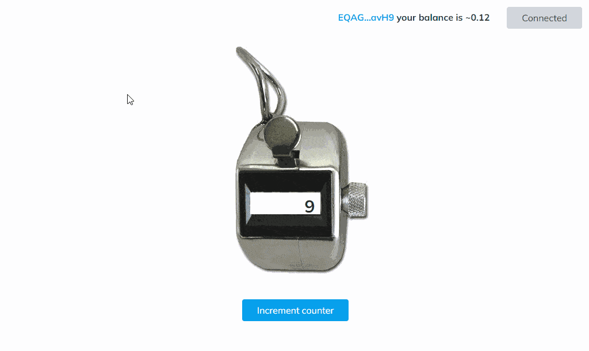

# Demo dApp for TON blockchain (may be used as boilerplate)

[](https://xtonwallet.com/ton-dapp-boilerplate/)

The main goal of this dApp is to demonstrate some the key aspects of developing a TON blockchain application for **WEB3**.

The application is a simple counter. The user receives the amount from the blockchain and can increase this value by 1. This value may be different, just the BOC that sends to TON blockchain is created with this value. See [./src/index.js#L33](./src/index.js#L33)

**Live demo you can test [here](https://xtonwallet.com/ton-dapp-boilerplate/)**

dApp consists of 2 main parts:

* Smart contracts for TON blockchain writeen on FunC language
* **WEB3** application written in vanilla javascript. But you can use any frameworks for your aims.

# Smart contracts

To test smart contracts before the deploying you can use [tests/main.spec.js](./tests/main.spec.js) file. 
To test the `main` smart contract code need to run in the console:

```console
yarn run test
```

Test system built based on two pakages [ton-contract-executor](https://github.com/ton-community/ton-contract-executor) and [jest](https://jestjs.io/docs/getting-started).

This approach does not require interaction with TON blockchain. You can develop a smart contract even **offline** without installing additional software.

The code for part of TON blockchain can be found in the `contracts` folder. `./contracts/src/` contains the smart contract code `main.fc` and the standard library `stdlib.fc`. To compile the code, you need to run in the console:

```console
yarn run compile
```

This command will create the `main.boc` and `main.fift` files in the `./contracts/build/` folder. This folder also contains the `main.deploy.js` file, which is used to deploy the smart contract.

For the deployment process, you must specify your wallet from which smart contracts will be deployed. Your wallet information will be taken from the `.env` file, you can rename the `.env_example` file to `.env` (where you need specify DEPLOYER_MNEMONIC - the seed phrase for the wallet) or create a new wallet during deployment. In this case, you will need to replenish the balance of the created wallet.

To deploy the `main` smart contract on TON `testnet` blockchain, you need to run in the console:

```console
yarn run deploy:testnet
```

To deploy the `main` smart contract on TON `mainnet` blockchain, you need to run in the console:

```console
yarn run deploy
```

# WEB3 application

The dApp must use a `wallet extension` or a browser that supports the [TEPs105](https://github.com/ton-blockchain/TEPs/pull/105) standard. This standard defines how the dApp can communicate with the TON blockchain through a `wallet provider`.

This dApp demonstrates the following approaches:

* Requests permissions from the user.
* Get user endpoint and account. Keep track of when they change.
* Get information directly from the TON blockchain.
* Send a transaction to the TON blockchain.
* Wait for the transaction to be confirmed on the TON blockchain.

To run the local webserver:

```console
yarn start 
```

Open http://localhost:10007 to start developing own dApp.

# Supported web wallets

To test your wallet on compatibility with TEPs105 you can run in browser console this command:

```js
typeof(window.ton) != "undefined" && window.ton.isTEPs105
```

# General workflow for the WEB3 development process

* Write a code on FunC language in `./contracts/src` folder
* Write tests for each smart contract in `./tests/`
* Run all tests `yarn test`
* Compile with `yarn run compile` command. This command will create `.boc` (this file will be used for the deployment process) and `.fift` (this file can be used for debugging) in `./contracts/build`
* Add file `[my_smart_contract_name].deploy.js` to `./contracts/build` folder, there you should specify your `initData` for this smart contract and `initMessage`, optionally you can specify `postDeployTest`
* Run `yarn run deploy:testnet` to deploay on `testnet` TON blockchain
* Start the local web server with `yarn start`. The web server has a livereload function. Navigate to http://localhost:10007/ to see the rendered result.
* Write WEB3 frontend in `/src/` folder. You can use any frameworks. Just don't forget to add them with `yarn add` command.
* Run `yarn run deploy` to deploay on `mainnet` TON blockchain
* &#129351; **Completed!** You have created dApp on TON blockchain